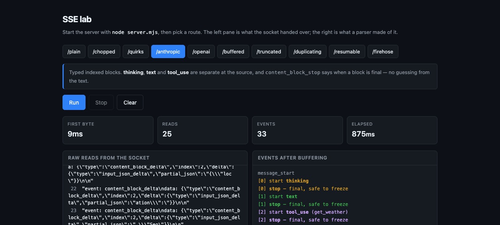

# SSE lab

AI 채팅의 스트리밍이 실제로 어떻게 생겼는지, 그리고 어디서 깨지는지 직접 보는 실습장.

```bash
node server.mjs                  # 포트 8791
curl -N http://localhost:8791/   # 라우트 목록
open client.html                 # 브라우저에서 읽기/이벤트를 나란히
```

의존성 없음. Node 18 이상이면 그대로 돈다.



왼쪽은 소켓이 넘겨준 것, 오른쪽은 파서가 만들어낸 것이다. 두 숫자가 같은 경우는 거의 없다.

---

## 1. SSE 는 프로토콜이 아니라 응답 본문 규칙이다

WebSocket 은 핸드셰이크로 프로토콜을 바꾼다. SSE 는 **그냥 HTTP 응답인데 끝나지 않을 뿐**이다.

```
HTTP/1.1 200 OK
Content-Type: text/event-stream; charset=utf-8
Cache-Control: no-cache, no-transform
Transfer-Encoding: chunked          ← Content-Length 가 없다. 이게 전부다.
```

`Content-Length` 를 못 쓰니 `chunked` 로 보낸다. 프록시·CDN·회사 방화벽이 전부 통과시키는 이유가 이것이다 — 걔들 눈에는 그냥 느린 응답이다.

**단방향이다.** 서버 → 클라이언트만 된다. 사용자 입력은 별도 POST 로 보낸다. 채팅에 충분한 이유는, 토큰은 내려오기만 하면 되기 때문이다.

---

## 2. 가장 중요한 사실: 청크는 이벤트가 아니다

```bash
node read.mjs chopped reads
```

```
  read   1  "data: S"
  read   2  "erver-S"
  read   3  "ent\n\nda"      ← 이벤트 끝 + 다음 이벤트 시작이 한 청크에
  read   4  "ta:  Ev"
```

TCP 는 SSE 를 모른다. 읽기 하나가 필드 이름 중간에서 잘리고, 이벤트 두 개가 한 번에 붙어 온다.

이걸 모르고 짜면:

```bash
node read.mjs chopped naive
```

```
  recovered: "S     "
  버려진 청크: 61개
```

**200자 답변에서 6자만 건졌다.** SSE 파서 버그의 대부분이 이 형태다.

**해법은 carry 버퍼 하나다.** 남은 조각을 들고 있다가 다음 청크와 이어붙이고, `\n\n` 으로 자르고, 마지막 미완성 조각은 다시 들고 있는다.

```js
carry += chunk
const parts = carry.split('\n\n')
carry = parts.pop()          // 마지막은 아직 미완성일 수 있다
for (const part of parts) handle(part)
```

---

## 3. 포맷 규칙

```bash
curl -N http://localhost:8791/quirks
```

| 문법 | 뜻 |
|---|---|
| `data: hello` | 페이로드 |
| `data:hello` | 같다. 콜론 뒤 **공백 한 칸은 프레이밍**이지 데이터가 아니다 |
| `data:  hello` | 값은 `" hello"`. 두 번째 공백부터가 데이터 |
| `data: a`<br>`data: b` | `"a\nb"`. 여러 줄은 `\n` 으로 합친다 |
| `event: token` | 이벤트 이름. 생략하면 `message` |
| `id: 42` | 재연결 시 `Last-Event-ID` 헤더로 되돌아온다 |
| `retry: 3000` | EventSource 재연결 지연(ms) |
| `: keep-alive` | 주석. 유휴 프록시가 끊지 않게 하는 하트비트 |
| `nonsense: x` | 모르는 필드는 무시. 에러 아님 |
| `\r\n` | CRLF 도 legal |
| 빈 줄 | **이벤트 종료.** 이게 유일한 구분자 |

마지막 함정: 서버가 **빈 줄 없이 소켓을 닫으면** 마지막 이벤트가 사라진다. 빈 줄에서만 emit 하는 파서는 조용히 버린다. 스트림 종료 시 `flush()` 가 필요한 이유다.

---

## 4. 프로바이더마다 모양이 다르다

### OpenAI — 평평한 텍스트 스트림

```bash
curl -N http://localhost:8791/openai
```

```
data: {"choices":[{"delta":{"content":"SSE"}}]}
data: [DONE]
```

이벤트 이름이 없다. 블록 구분도 없다. **하나의 문자열이 자랄 뿐**이고, 끝은 `[DONE]` 이라는 문자열 센티넬이다.

### Anthropic — 타입 있는 인덱스 블록

```bash
node read.mjs anthropic blocks
```

```
  [0] thinking               done=true
      "The user asked what SSE is. Keep it short."
  [1] text                   done=true
      "SSE is a one-way stream of text events over plain HTTP."
  [2] tool_use (get_weather) done=true
      "{\"location\": \"Seoul\"}"
```

원시 이벤트:

```
event: content_block_start   {"index":0,"content_block":{"type":"thinking"}}
event: content_block_delta   {"index":0,"delta":{"type":"thinking_delta",...}}
event: content_block_stop    {"index":0}          ← 이 블록은 확정
event: content_block_start   {"index":1,"content_block":{"type":"text"}}
...
event: message_stop
```

**차이가 크다.**

1. **한 응답에 여러 블록이 섞인다.** thinking → text → tool_use → text. 문자열 하나로 이어붙이면 사고가 본문에 섞이고 툴 JSON 이 화면에 뜬다.
2. **`content_block_stop` 이 "더 안 바뀜" 을 알려준다.** 마크다운을 파싱해서 문단 끝을 추측할 필요가 없다. 완료된 블록은 memo 로 얼려도 안전하다.
3. **툴 인자는 JSON 조각으로 온다.** `{"loc` → `ation":` → ` "Seo` → `ul"}`. 개별로는 파싱 불가. **다 모아서 마지막에 한 번** 파싱한다.

즉 **UI 모델은 "자라나는 문자열" 이 아니라 "타입 있는 블록의 배열"** 이어야 한다.

---

## 5. 왜 `EventSource` 를 안 쓰나

브라우저에 내장 SSE 클라이언트가 있는데 LLM 채팅은 거의 안 쓴다.

| EventSource 제약 | 채팅에서 필요한 것 |
|---|---|
| GET 만 | 프롬프트를 **POST body** 로 보내야 함 |
| 커스텀 헤더 불가 | `Authorization`, `anthropic-version` |
| 자동 재연결 (끌 수 없음) | 반쯤 생성된 답변을 재연결하면 중복 |

그래서 `fetch` + `response.body.getReader()` 로 직접 읽는다. 대신 재연결·`Last-Event-ID` 처리를 직접 해야 한다.

---

## 6. 실무 실패 모드

### 압축·프록시 버퍼링 — 로컬은 되는데 배포하면 안 되는 것

```bash
node timing.mjs
```

```
  plain      첫 바이트    45ms | 전체 1388ms | 청크 34개
  buffered   첫 바이트  1513ms | 전체 1513ms | 청크  1개   ← 스트리밍이 아님
```

같은 데이터, 같은 결과. 그런데 하나는 스트림이고 하나는 아니다. **본문만 봐서는 구분할 수 없다.**

범인은 대개 gzip 미들웨어, nginx `proxy_buffering on`, CDN 이다. 방어:

```
Cache-Control: no-cache, no-transform
X-Accel-Buffering: no
```
그리고 **SSE 응답은 압축하지 않는다.**

### 중간에 끊김 — 에러로 안 보인다

```bash
node trunc.mjs
```

```
  받은 내용: "data: Server-Sent | data:  Events | ... | data:  channel: |"
  [DONE] 없음
```

소켓이 죽어도 그냥 스트림이 끝난 것처럼 보인다. **프로토콜에는 "응답이 불완전함" 신호가 없다.** `[DONE]` 과 `message_stop` 이 존재하는 이유가 정확히 이것이다 — 완결을 페이로드가 증명해야 한다.

**규칙: 종료 이벤트를 못 받았으면 완료로 처리하지 않는다.**

### 재연결하면 중복된다

```bash
curl -N -H "Last-Event-ID: 5" http://localhost:8791/resumable
```

이어받기는 서버가 `id:` 를 붙이고 클라이언트가 되돌려줄 때만 된다. **대부분의 LLM API 는 이걸 지원하지 않는다.** 그래서 첫 토큰이 화면에 나온 뒤의 재연결은 처음부터 다시 받게 되고, 화면에 이미 있는 텍스트와 겹친다.

**그래서 재시도는 "아직 아무것도 안 그렸을 때" 로 한정하는 게 맞다.**

---

## 7. 백프레셔는 자동이다 — 소켓까지만

```bash
node backpressure.mjs
```

서버는 3초 동안 전력으로 쓰고, 소비자만 바꾼다.

| 소비자 | 서버가 쓴 이벤트 | 받은 양 | drain 대기 |
|---|---|---|---|
| 지연 없음 | 3,304,383 | 1,638 MB | 103,262회 |
| 읽기당 5ms | **71,882** | 35 MB | 2,246회 |

**소비자가 느리다는 이유만으로 서버 생산량이 46배 줄었다.** 둘 다 31번째 write 에서 처음 막혔는데, 512바이트 × 31 ≈ 16KB — 소켓 송신 버퍼다.

동작 원리는 이렇다. `res.write()` 가 `false` 를 돌려주면 Node 의 출력 버퍼가 한계를 넘었다는 뜻이고, 그건 커널 송신 버퍼가 찼다는 뜻이고, 그건 상대가 안 읽고 있다는 뜻이다. TCP 백프레셔가 유저랜드까지 올라온 것이다. 반환값을 무시하고 계속 쓰면 느려지는 대신 **자기 힙이 자란다.**

**그런데 여기까지다.** `reader.read()` 로 청크를 가져오는 순간 그건 내 메모리에 있고 아무도 밀어내지 않는다.

> 채팅 UI 가 실제로 막히는 지점은 네트워크가 아니라 렌더다.

토큰이 초당 300개 오는데 마크다운 렌더가 프레임을 못 맞추면, 백프레셔는 아무것도 안 해준다. 이미 읽어버렸으니까. 그 구간은 배칭이나 드롭으로 직접 막아야 한다.

---

## 8. 재연결은 페이로드가 허락해야 된다

```bash
node reconnect.mjs
```

**id 가 없을 때** — 대부분의 LLM API 가 이렇다.

```
1차: "Server-Sent Events is a one-way channel:"      ← 소켓 죽음
2차: "Server-Sent Events is a one-way channel: the server writes..."
이어붙이면: 앞 40자가 화면에 두 번
```

**id 가 있을 때**

```
1차: id 12 까지 받고 끊김
2차: Last-Event-ID: 12  →  " It rides on a normal HTTP response..."
겹침 없음
```

차이는 클라이언트가 아니다. 둘 다 재연결한다. **페이로드에 서버가 이어붙일 수 있는 identity 가 있느냐**가 전부다.

LLM 델타 스트림에는 없다. `text_delta` 에 id 가 없고, 모델이 같은 토큰을 다시 만들어주지도 않는다. 그래서 "재연결해서 이어받기" 는 선택지가 아니고, 정직한 선택지는 셋뿐이다.

- **첫 렌더 전까지만 재시도** — 싸고 정확하지만 범위가 좁다
- **서버에서 request id 로 버퍼링** — 되지만 인프라가 필요하다
- **부분 답변 + 에러 표시** — 포기하는 쪽

**첫 렌더 이후에 재시도해서 이어붙이는 것만은 항상 틀린다.** 그리고 아무 생각 없이 짜면 그게 기본 동작이다.

---

## 정리 — 채팅 UI 를 만든다면

1. `fetch` + `getReader()`, `EventSource` 아님
2. **carry 버퍼** — 청크 경계는 이벤트 경계가 아니다
3. 스트림 끝에서 **flush** — 마지막 이벤트가 빈 줄 없이 올 수 있다
4. 상태 모델은 **타입 있는 블록 배열**, 문자열 하나가 아님
5. 툴 인자 JSON 은 **모아서 마지막에 한 번** 파싱
6. **완결은 종료 이벤트로만** 판정
7. 재시도는 **첫 렌더 전까지만**
8. 배포 전에 **첫 바이트 시간**을 잰다 — 버퍼링은 조용히 스트리밍을 죽인다

---

## 파일

```
server.mjs        10개 라우트, 각각 하나의 현상을 재현
client.html       브라우저에서 읽기와 이벤트를 나란히 (의존성 없음)
read.mjs          소켓 읽기 / 순진한 파서 / 블록 조립
timing.mjs        스트리밍 vs 버퍼링 첫 바이트 비교
backpressure.mjs  느린 소비자가 서버를 얼마나 늦추는지
reconnect.mjs     id 있을 때와 없을 때의 재연결
trunc.mjs         중간 끊김이 어떻게 보이는지
```

숫자는 전부 이 저장소를 이 저장소가 만들어진 맥에서 돌려 나온 실측이다. 직접 돌리면 절대값은 달라도
비율은 재현된다.
